# Всім привіт! Мене звати Ваня і я новенький в IT-сфері

<h2>Git Basics</h2>

Я пройшов 2-тижневий курс на сайті Coursera і вся інформація була для мене новою, важкою та цікавою. Здивував великий функціонал Git та GitHub. Буду використовувати всі вивчені команди в майбутньому.  
Cкріншот першого тижня: https://skr.sh/sFOPDtWvOFe?a.  
Скріншот другого тижня: https://skr.sh/sFOdeJLOz7l?a.

### learngitbranching.js.org

Основи: Introduction Sequence — https://skr.sh/sFOZqG3Mc6r?a.  
Віддалені репозиторії: Push & Pull — https://skr.sh/sFOJu0bcW3V?a.

<h2>Linux CLI, and HTTP</h2>

### Linux:

Інформація була цікавою. Не знаю чи буду користуватися Linux в майбутньому, але для саморозвутку згодиться.

 
Перший модуль

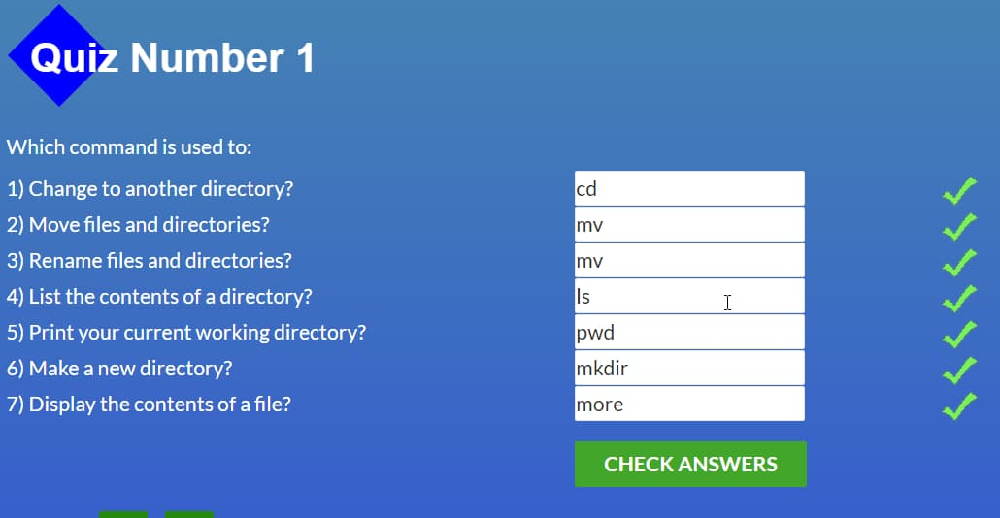

 
Другий модуль

 
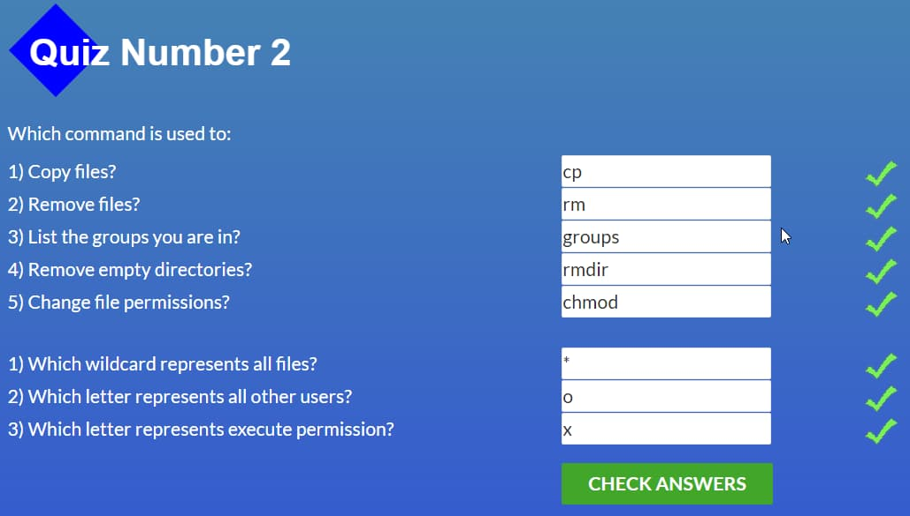

 
Третій модуль

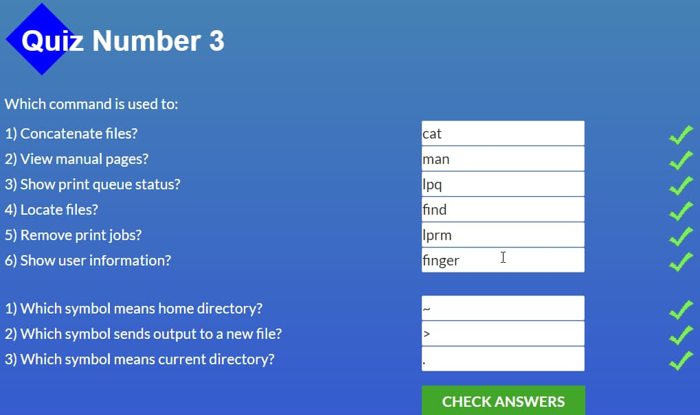

 
Четвертий модуль

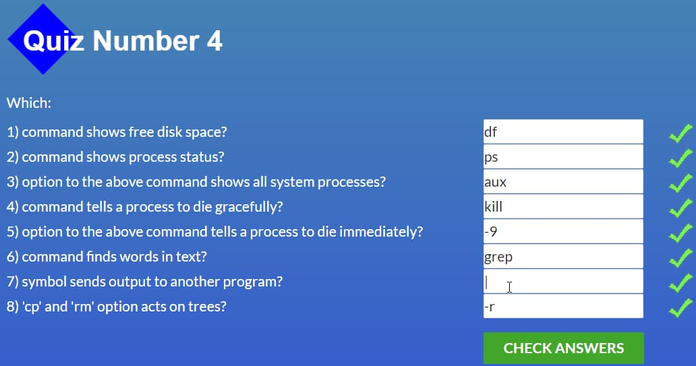

### HTTP:

Новим для мене було використання HTTP у фреймворках та бібліотеках таких як: ExpressJS (для Node), Ruby on Rails та jQuery Ajax. Здивувало те, що в залежності від того, де міститься кеш, можна виділити наступні його категорії: Приватний та Публічний.

<h2>Git Collaboration</h2>

Дуже радий, що додивився до кінця, дізнався дуже багато цікавої і корисної інформації щодо Git та Github і я розумію, що без цього працювати в команді буде дуже складно.  

3 Тиждень

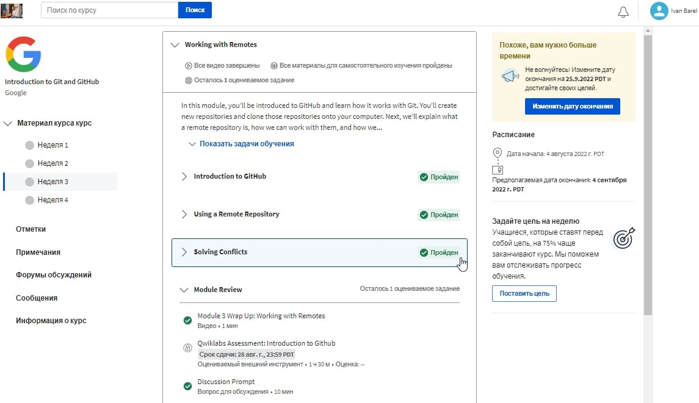

4 Тиждень

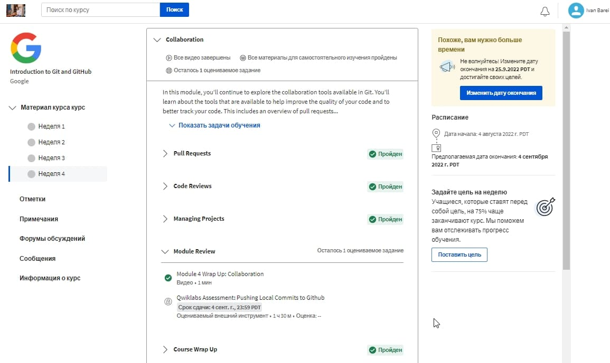

### learngitbranching.js.org

Основи: Їдемо далі, Переміщуємо роботу туди-сюди

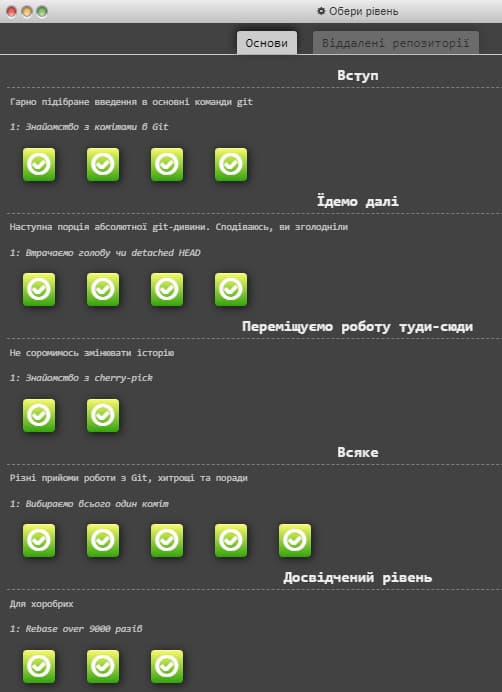

Віддалені репозиторії: Через origin – до зірок. Прогресивне використання Git Remotes

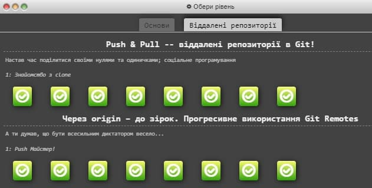

<h2>Intro to HTML and CSS</h2>

З основами HTML та CSS я був знайомий. Проте про Bootstrap раніше нічого не знав. Новим також була і система Grid. Однак як на мене Bootstrap вже застарівша технологія.

Cкріншот першого тижня:

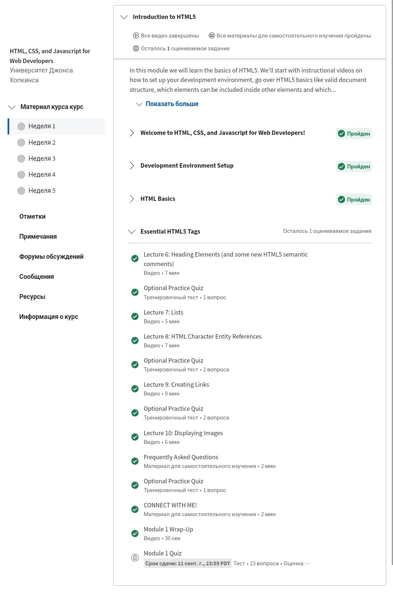

Скріншот другого тижня:

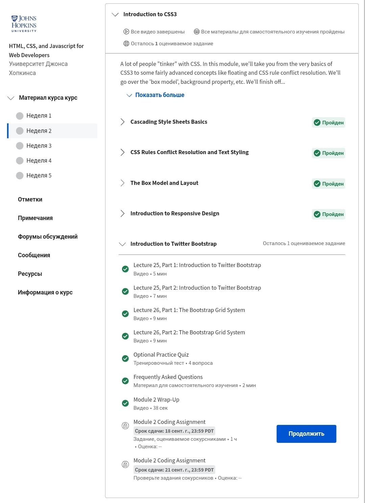

### Learn HTML & CSS:

Курси пройдено

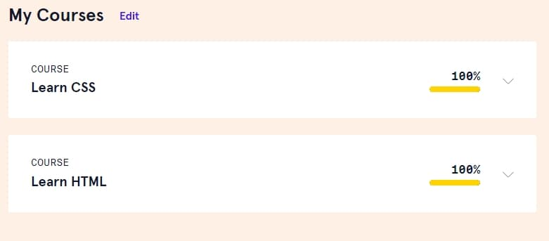

Краще розібрався як писати код CSS одразу в коді HTML, використовуючи потрібні стилі. Пригадав деякий матеріал, котрий використовуватиму в майбутньому.

<h2>Responsive Web Design</h2>

З позиціонуванням не був знайомий, тому дуже радий, що вже його освоїв як Flex, так і Grid технології. В майбутньому обов'язково буду використовувати отримані з даного розділу технології.

Скріншот прохождення Flex Froggy

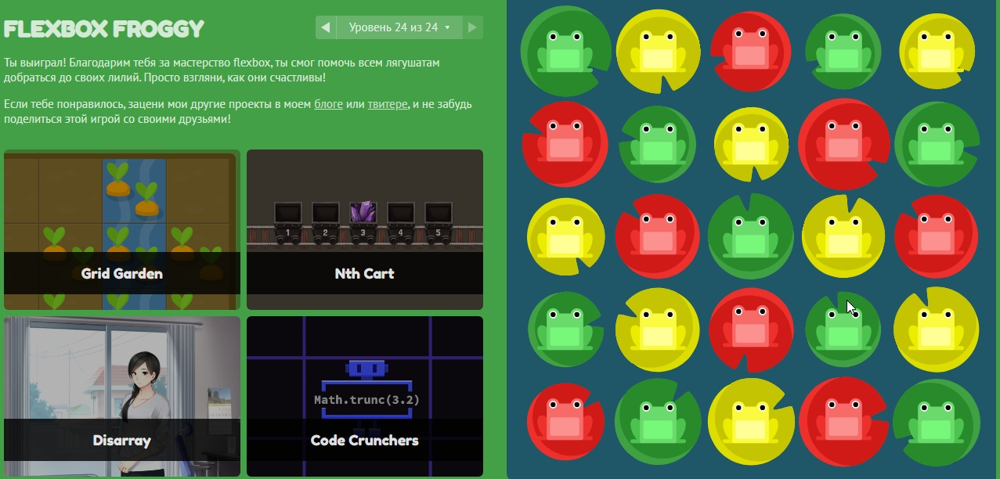

Скріншот прохождення Grid Garden

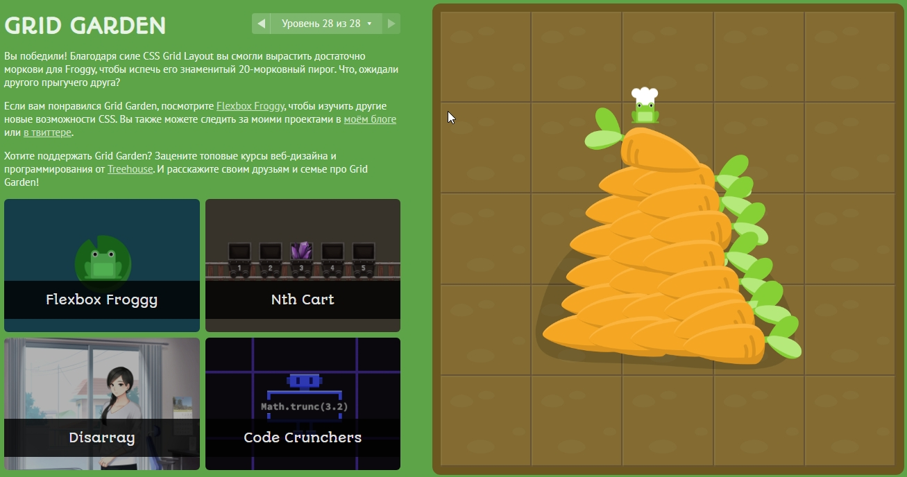

